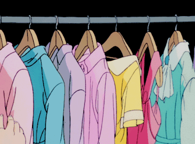

<h1 align = "center">
ִ ࣪𖤐 PORMA-tics ⋆ ˚｡⋆୨୧˚
</h1>

<h3 align = "center">
Something small description or tagline here
</h3>

<p align="center">
  

## **✌︎㋡ 𝜚˚⋆ | DESCRIPTION**
<p align = "justify" >
<u>PORMA-tics</u> is a C# Windows Forms-based wardrobe management and outfit generation system designed to help users organize their clothing digitally and generate outfit combinations based on their preferred style and season. The system allows users to upload clothing items, categorize them into different sections such as tops, bottoms, shoes, and accessories, and automatically generate matching outfits using filtering logic.

The application focuses on convenience, accessibility, and personalization by giving users a virtual closet experience where they can manage their fashion choices efficiently. Users can also save their favorite generated outfits for future reference, making outfit planning faster and more organized.
</p>

---

## **✌︎㋡ 𝜚˚⋆ | PURPOSE**
<p align = "justify" >
The purpose of <u>PORMA-tics</u> is to provide users with a smart and organized way to manage their clothing collections digitally while helping them decide what outfits to wear through automatic outfit generation. Many people struggle with organizing clothes and choosing matching outfits, especially when handling multiple clothing items manually.
</p>

### The system aims to:

- Provide a digital closet system for organizing clothing items
- Help users generate outfit combinations based on filters
- Allow users to save favorite outfits for future use
- Reduce time spent deciding what to wear
- Improve user convenience through an easy-to-use graphical interface

## ✌︎㋡ 𝜚˚⋆ | UML DIAGRAM
<p align = "center">
 

## ✌︎㋡ 𝜚˚⋆ | FEATURES
<p align = "justify" >
<u>PORMA-tics</u> contains several functionalities that help users organize and generate outfits efficiently. The system combines user-friendly interface design with backend filtering and outfit generation logic.
</p>

### Main Features

- Digital wardrobe management system
- Upload and store clothing images without using a database
- Categorization of clothes into:
  - Tops
  - Bottoms
  - Shoes
  - Accessories
- Outfit generation based on:
  - Selected season
  - Preferred fashion style
- Favorite outfit saving system
- Automatic image storage and retrieval
- User-friendly graphical interface
- Responsive Windows Forms layout
- Local file-based data storage using JSON

### System Functionalities

- Upload clothing items with image preview
- Filter clothes before generating outfits
- Generate random matching outfits
- Regenerate outfits using the same filters
- Save generated outfits to favorites
- Browse saved favorite outfits
- Navigate through different closet categories
- Organize clothing records efficiently
<p align="center">
  
  
  
</p>

## **✌︎㋡ 𝜚˚⋆ | Program Structure** 
```
📂 Pormatics/
└── 📂 Properties/
    └── Resources.resx          
└── 📂 ClosetForm/
     └── AccessoriesCloset.cs
     └── AllCloset.cs
     └── ClosetBase.cs
     └── BottomCloset.cs
     └── MainMenuForm.cs
     └── ShoesCloset.cs
     └── TopCloset.cs
└── 📂 Data/
    └── StorageService.cs
└── 📂 FunctionalityForm/
    └── 📂OutifitGenerationForm/
    |   └──ConfirmGenerated.cs
    |   └──GenerateFilter.cs
    └── 📂UploadForm/
    |   └──UploadClothes.cs
    |   └──UploadFilter.cs
    └── FavoriteOutift.cs
    └── Settings.cs
└── 📂 Models/
    └── ClothingItem.cs
    └── FavoriteOutfitItem.cs
    └── GeneratedOutfit.cs
    └── OutfitFilter.cs
└── 📂 Resources/
└── 📂 Services/
    └── OutfitGeneratorService.cs
└── 📂 Utilities/
    └──  StartForm.cs
    └──  ThemeColor.cs

```

## ✌︎㋡ 𝜚˚⋆ | HOW DOES <u>*PORMA-tics*</u> WORKS?
<p align = "justify" >
The system works by allowing users to upload clothing items into the application and organize them into categories such as tops, bottoms, shoes, and accessories. Each uploaded item is stored locally together with its image and clothing information using JSON-based file storage.

When generating an outfit, users can select filters such as season and preferred style. The outfit generation system then processes the available clothing items and creates a matching outfit combination based on the selected filters.

After generating an outfit, users can:
</p>

- Confirm the generated outfit
- Generate another outfit using the same filters
- Save the outfit into the Favorites section
- Revisit saved outfits anytime

<p align = "justify" >
The system uses Object-Oriented Programming principles and modular backend services to separate the user interface, business logic, models, and storage management for better maintainability and scalability.
</p>

---

## ✌︎㋡ 𝜚˚⋆ | HOW TO RUN THE PROGRAM

#### 1. Clone or Download the Repository


```
git clone https://github.com/yourusername/Pormatics.git
```

#### 2. Open the Project in Visual Studio

```
Open Visual Studio
→ Click "Open a Project or Solution"
→ Select the Pormatics.sln file
```

#### 3. Install Required Dependencies
Make sure the following are installed:

- .NET Framework
- Visual Studio Desktop Development with C#
- Newtonsoft.Json package

If Newtonsoft.Json is missing:

```
Install-Package Newtonsoft.Json
```

#### 4. Run the Application

```
Pres F5 or Start Debugging in Visual Studio
```


# **✌︎㋡ 𝜚˚⋆ | Development team (GREUM)**


  
|     | Name   |Roles    |
|-----|--------|---------|
| <div align="center"></div> | Bernardo, Xiamara <br> [](https://github.com/Xiamara23)   | Narrative Designer|
| <div align="center"></div> |Carranceja, Mikyla <br> [](https://github.com/kykylim) | UI Designer |
| <div align="center"></div> |Gupilan, Shanlee Yvonne <br> [](https://github.com/Shanleegupilan8) | Quality Assurance|
| <div align="center"></div> | Mercado, Aaron Daniel <br> [](https://github.com/Aa-ronMer-cado) |Game Programmer  |

<h1 align="center">
  <b>THANK YOU FOR VISITING</b>
</h1>

<h3 align="center">
  <i>Mood over rules, freedom fuels ˗` PORMA‑tics ˊ˗  rewrites fashion’s schools.</i>
</h3>

<p align="center">
  
</p>

